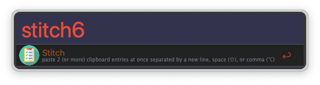

# StitchClip.alfredworkflow

Paste the 2 (or more) most recent clipboard entries separated by a new line, space, or comma.

Paste up to 6 entries at once, by appending a number to the keyword e.g. `stitch5`

By default, clipboard entries are separated by new lines. To separate clipboard entries with **spaces**, use the *shift* (⇧) modifier.  For **commas**, use the *option* (⌥) modifier.

That's about all there is to it.  Clip, clip away!

## Installation

You may download the latest release or clone the repository if you wish. However, all you really need is the [StitchClip.alfredworkflow](./StitchClip.alfredworkflow) file.  Click the download button in the upper-right corner of the Github interface.

Once downloaded, double click the file and follow Alfred's instructions.